# Application Layer — Overview Class Diagram

```mermaid
classDiagram
    %% === DATA TRANSFER OBJECTS ===
    class PaginatedResult~T~ {
        items: list[T]
        total: int
        page: int
        page_size: int
    }

    class RegisterData {
        email: str
        password: str
        nickname: str
    }

    class LoginData {
        email: str
        password: str
    }

    class TokenPair {
        access_token: str
        refresh_token: str
    }

    class ChangePasswordData {
        current_password: str
        new_password: str
    }

    class UpdateProfileData {
        nickname: str | None
        password: str | None
    }

    class RecipeData {
        name: str
        category_id: RecipeCategoryId
        servings: int
        ingredients: list[RecipeIngredient]
        steps: list[CookingStep]
        weight: int
        total_pieces: int | None
        pieces_per_portion: int | None
        link: str | None
        comment: str | None
    }

    class ProductData {
        name: str
        recipe_unit: str
        purchase_unit: str
        price_per_purchase_unit: Money
        brand: str
        supplier: str
        conversion_factor: float
        category_id: ProductCategoryId
    }

    class FamilyMemberData {
        name: str
        portion_multiplier: float
        comment: str
        preference_ids: list[PreferenceId]
    }

    class CategoryData {
        name: str
        category_id: int | None
        color: str | None
    }

    class PreferenceData {
        name: str
        type: PreferenceType
        mode: PreferenceMode
        category_ids: list[ProductCategoryId]
        product_ids: list[ProductId]
        recipe_category_ids: list[RecipeCategoryId]
    }

    class MealTypeData {
        name: str
        time: time
    }

    %% === CRUD BASE CLASSES ===
    class CreateEntity {
        <<abstract>>
        -_repo: Any
        +__init__(repo: Any)
        +_build_entity(data: Any, user_id: UserId) Any
        +execute(data: Any, user_id: UserId) Any
    }

    class EditEntity {
        <<abstract>>
        -_repo: Any
        -_label: str
        +__init__(repo: Any)
        +_build_entity(id: Any, data: Any, user_id: UserId) Any
        +execute(id: Any, data: Any, user_id: UserId) Any
    }

    class DeleteEntity {
        -_repo: Any
        +__init__(repo: Any)
        +execute(ids: Any, user_id: UserId) None
    }

    class GetEntity {
        -_repo: Any
        +__init__(repo: Any)
        +execute(id: Any, user_id: UserId) Any | None
    }

    class ListEntities {
        -_repo: Any
        +__init__(repo: Any)
        +execute(user_id: UserId, category_id: Any) list[Any]
    }

    class PaginatedListEntities {
        -_repo: Any
        +__init__(repo: Any)
        +execute(user_id: UserId, category_id: Any, page: int | None, search: str) PaginatedResult
    }

    %% === AUTHENTICATION USE CASES ===
    class RegisterUser {
        -_user_repo: UserRepository
        -_hasher: PasswordHasher
        -_family_repo: FamilyMemberRepository
        -_meal_type_repo: MealTypeRepository
        +execute(data: RegisterData) User
    }

    class LoginUser {
        -_user_repo: UserRepository
        -_hasher: PasswordHasher
        -_token_service: TokenService
        -_refresh_repo: RefreshTokenRepository
        +execute(data: LoginData) TokenPair
    }

    class RefreshAccessToken {
        -_token_service: TokenService
        -_refresh_repo: RefreshTokenRepository
        -_user_repo: UserRepository
        +execute(raw_refresh_token: str) TokenPair
    }

    class GetCurrentUser {
        -_token_service: TokenService
        -_user_repo: UserRepository
        +execute(access_token: str) User
    }

    class ChangePassword {
        -_user_repo: UserRepository
        -_hasher: PasswordHasher
        +execute(user: User, data: ChangePasswordData) None
    }

    class UpdateProfile {
        -_user_repo: UserRepository
        -_hasher: PasswordHasher
        +execute(user: User, data: UpdateProfileData) User
    }

    class LogoutUser {
        -_token_service: TokenService
        -_refresh_repo: RefreshTokenRepository
        +execute(raw_refresh_token: str) None
    }

    %% === RECIPE USE CASES ===
    class CreateRecipe {
        <<extends CreateEntity>>
        -_validator: RecipeDependencyValidator | None
        +execute(data: RecipeData, user_id: UserId) Recipe
    }

    class EditRecipe {
        <<extends EditEntity>>
        -_validator: RecipeDependencyValidator | None
        +execute(id: RecipeId, data: RecipeData, user_id: UserId) Recipe
    }

    class GetRecipe {
        <<alias GetEntity>>
    }

    class DeleteRecipe {
        <<alias DeleteEntity>>
    }

    class ListRecipes {
        <<alias ListEntities>>
    }

    class PaginatedListRecipes {
        <<alias PaginatedListEntities>>
    }

    %% === PRODUCT USE CASES ===
    class CreateProduct {
        <<extends CreateEntity>>
    }

    class EditProduct {
        <<extends EditEntity>>
    }

    class GetProduct {
        <<alias GetEntity>>
    }

    class DeleteProduct {
        <<alias DeleteEntity>>
    }

    class ListProducts {
        <<alias ListEntities>>
    }

    class PaginatedListProducts {
        <<alias PaginatedListEntities>>
    }

    %% === MENU PLANNING USE CASES ===
    class CreateMenu {
        -_repo: MenuRepository
        +execute(name: str, user_id: UserId) WeeklyMenu
    }

    class SaveMenu {
        -_repo: MenuRepository
        +execute(menu: WeeklyMenu) WeeklyMenu
    }

    class LoadMenu {
        -_repo: MenuRepository
        +execute(menu_id: MenuId, user_id: UserId) WeeklyMenu | None
    }

    class DeleteMenu {
        -_repo: MenuRepository
        +execute(menu_id: MenuId, user_id: UserId) None
    }

    class ListMenus {
        -_repo: MenuRepository
        +execute(user_id: UserId) list[WeeklyMenu]
    }

    class AddDishToSlot {
        -_repo: MenuRepository
        +execute(menu_id: MenuId, slot: MenuSlot, user_id: UserId) WeeklyMenu
    }

    class MoveSlotInMenu {
        -_repo: MenuRepository
        +execute(menu_id: MenuId, day: int, meal_type_id: MealTypeId, ...) WeeklyMenu
    }

    class RemoveItemFromSlot {
        -_repo: MenuRepository
        +execute(menu_id: MenuId, day: int, meal_type_id: MealTypeId, ...) WeeklyMenu
    }

    %% === SHOPPING LIST USE CASES ===
    class GenerateShoppingList {
        -_menu_repo: MenuRepository
        -_builder: ShoppingListBuilder
        +execute(menu_id: MenuId, user_id: UserId) ShoppingList
    }

    class GenerateFilteredShoppingList {
        -_menu_repo: MenuRepository
        -_builder: ShoppingListBuilder
        +execute(menu_id: MenuId, slot_indices: set[int], user_id: UserId) ShoppingList
    }

    class GenerateAndSaveShoppingList {
        -_menu_repo: MenuRepository
        -_list_repo: SavedShoppingListRepository
        -_builder: ShoppingListBuilder
        +execute(menu_id: MenuId, name: str, user_id: UserId) SavedShoppingList
    }

    class ManageSavedShoppingList {
        <<trait: load, get, list, delete>>
    }

    class ExportShoppingList {
        -_exporter: EntityExporter
        +execute(shopping_list: ShoppingList) tuple[bytes, str, str]
    }

    %% === RECIPE ANALYSIS USE CASES ===
    class FlattenRecipeProducts {
        -_builder: ShoppingListBuilder
        +execute(recipe_id: RecipeId, user_id: UserId) dict[ProductId, Quantity]
    }

    class PreviewFlattenedProducts {
        -_builder: ShoppingListBuilder
        -_recipe_repo: RecipeRepository
        +execute(recipe: Recipe) dict[ProductId, Quantity]
    }

    class ValidateSubRecipe {
        -_validator: RecipeDependencyValidator
        +execute(recipe_id: RecipeId, sub_recipe_ids: list[RecipeId]) None
    }

    class GenerateMealSummary {
        -_builder: ShoppingListBuilder
        -_recipe_repo: RecipeRepository
        +execute(recipe_id: RecipeId, scale_factor: float, user_id: UserId) list[IngredientNode]
    }

    %% === CATEGORY USE CASES ===
    class ManageCategory {
        +get_active() list[ActiveCategory]
        +get_all() list[Category]
        +create() int
        +update() int
        +delete() None
        +hard_delete() None
        +is_used() bool
        +move_and_delete() None
    }

    %% === FAMILY USE CASES ===
    class CreateFamilyMember {
        <<extends CreateEntity>>
    }

    class EditFamilyMember {
        <<extends EditEntity>>
    }

    class DeleteFamilyMember {
        <<alias DeleteEntity>>
    }

    class ListFamilyMembers {
        <<alias ListEntities>>
    }

    class AssignPreferences {
        -_family_repo: FamilyMemberRepository
        -_pref_repo: PreferenceRepository
        +execute(member_id: FamilyMemberId, pref_ids: list[PreferenceId], user_id: UserId) FamilyMember
    }

    %% === PREFERENCE USE CASES ===
    class CreatePreference {
        -_repo: PreferenceRepository
        +execute(data: PreferenceData, user_id: UserId) Preference
    }

    class UpdatePreference {
        -_repo: PreferenceRepository
        +execute(preference_id: PreferenceId, data: PreferenceData, user_id: UserId) Preference
    }

    class DeletePreference {
        -_preference_repo: PreferenceRepository
        -_family_repo: FamilyMemberRepository
        +execute(preference_id: PreferenceId, user_id: UserId) None
    }

    class ListPreferences {
        -_repo: PreferenceRepository
        +execute(user_id: UserId) list[Preference]
    }

    class MatchRecipePreferences {
        -_recipe_repo: RecipeRepository
        -_preference_repo: PreferenceRepository
        -_matcher: PreferenceMatcher
        +execute(recipe_id: RecipeId, user_id: UserId) list[Preference]
    }

    %% === MEAL TYPE USE CASES ===
    class ListMealTypes {
        -_repo: MealTypeRepository
        +execute(user_id: UserId) list[MealType]
    }

    class CreateMealType {
        -_repo: MealTypeRepository
        +execute(data: MealTypeData, user_id: UserId) MealType
    }

    class UpdateMealType {
        -_repo: MealTypeRepository
        +execute(meal_type_id: MealTypeId, data: MealTypeData, user_id: UserId) MealType
    }

    class DeleteMealType {
        -_repo: MealTypeRepository
        +execute(meal_type_id: MealTypeId, user_id: UserId) None
    }

    class CheckMealTypeUsage {
        -_repo: MealTypeRepository
        +execute(meal_type_id: MealTypeId, user_id: UserId) list[tuple[int, str]]
    }

    class CreateSystemMealTypes {
        -_repo: MealTypeRepository
        +execute(user_id: UserId) list[MealType]
    }

    %% === IMPORT/EXPORT USE CASES ===
    class ExportEntities {
        -_repo: Any
        -_exporter: EntityExporter
        +execute(user_id: UserId) tuple[bytes, str, str]
    }

    class ImportEntities {
        -_importer: EntityImporter
        +execute(data: bytes, user_id: UserId) ImportResult
    }

    %% === DEPENDENCIES ===
    CreateEntity --> UserRepository : depends_on
    EditEntity --> UserRepository : depends_on
    DeleteEntity --> UserRepository : depends_on

    RegisterUser --> UserRepository
    RegisterUser --> PasswordHasher
    RegisterUser --> FamilyMemberRepository
    RegisterUser --> MealTypeRepository
    RegisterUser --> CreateSystemMealTypes

    LoginUser --> UserRepository
    LoginUser --> PasswordHasher
    LoginUser --> TokenService
    LoginUser --> RefreshTokenRepository

    RefreshAccessToken --> TokenService
    RefreshAccessToken --> RefreshTokenRepository
    RefreshAccessToken --> UserRepository

    CreateRecipe --> CreateEntity
    CreateRecipe --> RecipeRepository
    CreateRecipe --> RecipeDependencyValidator

    EditRecipe --> EditEntity
    EditRecipe --> RecipeRepository
    EditRecipe --> RecipeDependencyValidator

    CreateMenu --> MenuRepository
    SaveMenu --> MenuRepository
    LoadMenu --> MenuRepository
    AddDishToSlot --> MenuRepository
    MoveSlotInMenu --> MenuRepository

    GenerateShoppingList --> MenuRepository
    GenerateShoppingList --> ShoppingListBuilder

    GenerateAndSaveShoppingList --> MenuRepository
    GenerateAndSaveShoppingList --> SavedShoppingListRepository
    GenerateAndSaveShoppingList --> ShoppingListBuilder

    FlattenRecipeProducts --> ShoppingListBuilder
    GenerateMealSummary --> ShoppingListBuilder
    GenerateMealSummary --> RecipeRepository

    ValidateSubRecipe --> RecipeDependencyValidator

    AssignPreferences --> FamilyMemberRepository
    AssignPreferences --> PreferenceRepository

    CreatePreference --> PreferenceRepository
    UpdatePreference --> PreferenceRepository
    DeletePreference --> PreferenceRepository
    DeletePreference --> FamilyMemberRepository

    ListMealTypes --> MealTypeRepository
    CreateMealType --> MealTypeRepository
    UpdateMealType --> MealTypeRepository
    DeleteMealType --> MealTypeRepository
    CheckMealTypeUsage --> MealTypeRepository
    CreateSystemMealTypes --> MealTypeRepository

    MatchRecipePreferences --> RecipeRepository
    MatchRecipePreferences --> PreferenceRepository
    MatchRecipePreferences --> PreferenceMatcher

    ExportEntities --> EntityExporter
    ImportEntities --> EntityImporter
```

## Layer Summary

The **Application Layer** contains:
- **6 CRUD Base Classes** (CreateEntity, EditEntity, DeleteEntity, GetEntity, ListEntities, PaginatedListEntities)
- **25+ Use Cases** organized by domain:
  - Authentication (7): RegisterUser, LoginUser, RefreshAccessToken, GetCurrentUser, ChangePassword, UpdateProfile, LogoutUser
  - Recipe Management (6): CreateRecipe, EditRecipe, GetRecipe, DeleteRecipe, ListRecipes, PaginatedListRecipes
  - Product Management (6): CreateProduct, EditProduct, GetProduct, DeleteProduct, ListProducts, PaginatedListProducts
  - Menu Planning (8): CreateMenu, SaveMenu, LoadMenu, DeleteMenu, ListMenus, AddDishToSlot, MoveSlotInMenu, RemoveItemFromSlot
  - Shopping List (5): GenerateShoppingList, GenerateFilteredShoppingList, GenerateAndSaveShoppingList, ManageSavedShoppingList, ExportShoppingList
  - Recipe Analysis (4): FlattenRecipeProducts, PreviewFlattenedProducts, ValidateSubRecipe, GenerateMealSummary
  - Family Management (6): CreateFamilyMember, EditFamilyMember, DeleteFamilyMember, ListFamilyMembers, AssignPreferences
  - Preference Management (5): CreatePreference, UpdatePreference, DeletePreference, ListPreferences, MatchRecipePreferences
  - Meal Type Management (6): ListMealTypes, CreateMealType, UpdateMealType, DeleteMealType, CheckMealTypeUsage, CreateSystemMealTypes
  - Category Management (1): ManageCategory
  - Import/Export (2): ExportEntities, ImportEntities
- **13+ DTOs** (RegisterData, LoginData, TokenPair, RecipeData, ProductData, etc.)
- **1 Generic Result** (PaginatedResult[T])
- **Helper Functions** (load_owned for ownership verification)

**Key Patterns:**
- CRUD base classes reduce boilerplate across Recipe, Product, FamilyMember domains
- Each use case is one class with single `execute()` method
- DTO classes bridge API layer and domain entities
- Ownership checks prevent cross-user data access
- Repository dependency injection enables easy testing
