# Domain Layer — Overview Class Diagram

```mermaid
classDiagram
    %% === ENTITIES ===
    class User {
        id: UserId
        email: str
        nickname: str
        hashed_password: str
        created_at: datetime
        last_login_at: datetime | None
    }

    class Recipe {
        id: RecipeId
        name: str
        servings: int
        ingredients: list[RecipeIngredient]
        steps: list[CookingStep]
        category_id: RecipeCategoryId
        weight: int
        user_id: UserId
        total_pieces: int | None
        pieces_per_portion: int | None
        link: str | None
        comment: str | None
        scale_to()
        is_pieces_mode: bool
        computed_servings: int
    }

    class Product {
        id: ProductId
        name: str
        recipe_unit: str
        purchase_unit: str
        price_per_purchase_unit: Money
        brand: str
        supplier: str
        conversion_factor: float
        category_id: ProductCategoryId
        user_id: UserId
        compute_purchase()
        purchase_cost()
    }

    class FamilyMember {
        id: FamilyMemberId
        name: str
        portion_multiplier: float
        comment: str
        user_id: UserId
        preference_ids: list[PreferenceId]
        effective_servings()
    }

    class WeeklyMenu {
        id: MenuId
        name: str
        slots: list[MenuSlot]
        user_id: UserId
        add_or_replace_slot()
        move_slot()
        remove_item()
        clear_slots()
    }

    class MenuSlot {
        day: int
        meal_type_id: MealTypeId
        recipe_id: RecipeId | None
        product_id: ProductId | None
        quantity: float | None
        unit: str | None
        servings_override: float | None
        pieces_override: int | None
        position: int
        member_ids: list[FamilyMemberId]
    }

    class ShoppingList {
        items: list[ShoppingListItem]
        total_cost()
        items_by_category()
    }

    class ShoppingListItem {
        product_id: ProductId
        product_name: str
        category: str
        quantity: Quantity
        cost: Money
        purchased: bool
        recipe_quantity: Quantity | None
        buy_quantity: Quantity
    }

    class SavedShoppingList {
        id: SavedShoppingListId
        user_id: UserId
        name: str
        items: list[SavedShoppingListItem]
        source_menu_id: MenuId | None
        created_at: datetime
        updated_at: datetime
        total_cost()
        items_by_category()
    }

    class SavedShoppingListItem {
        id: SavedShoppingListItemId
        product_id: ProductId | None
        product_name: str
        category: str
        quantity: Quantity
        buy_quantity: Quantity
        buy_quantity_overridden: bool
        cost: Money
        purchased: bool
        recipe_quantity: Quantity | None
        item_order: int
    }

    class RefreshToken {
        id: RefreshTokenId
        user_id: UserId
        token_hash: str
        expires_at: datetime
        revoked: bool
    }

    class Preference {
        id: PreferenceId
        name: str
        type: PreferenceType
        mode: PreferenceMode
        category_ids: list[ProductCategoryId]
        product_ids: list[ProductId]
        recipe_category_ids: list[RecipeCategoryId]
        user_id: UserId
    }

    class MealType {
        id: MealTypeId
        user_id: UserId
        name: str
        time: time
        is_system: bool
        sort_order: int
        MAX_CUSTOM_PER_USER: int
        MAX_NAME_LENGTH: int
    }

    %% === VALUE OBJECTS ===
    class Quantity {
        amount: float
        unit: str
        convert_to()
        is_weight: bool
    }

    class Money {
        amount: Decimal
        currency: str
    }

    class RecipeIngredient {
        product_id: ProductId | None
        sub_recipe_id: RecipeId | None
        quantity: Quantity
        order: int
        is_sub_recipe: bool
        is_product: bool
    }

    class CookingStep {
        order: int
        description: str
    }

    class ActiveCategory {
        id: int
        name: str
        color: str | None
    }

    class Category {
        id: int
        name: str
        active: bool
        color: str | None
    }

    class PreferenceType {
        <<enumeration>>
        CATEGORY_BASED
        ALLERGY
    }

    class PreferenceMode {
        <<enumeration>>
        BLOCKED
        ALLOWED
    }

    class ImportResult {
        created: int
        updated: int
        errors: list[str]
    }

    %% === REPOSITORY PORTS ===
    class UserRepository {
        <<interface>>
        get_by_id()
        get_by_email()
        save()
    }

    class RecipeRepository {
        <<interface>>
        get_by_id()
        find_by_category_id()
        find_all()
        count()
        find_page()
        save()
        delete()
        find_parents_of()
        find_by_name()
    }

    class ProductRepository {
        <<interface>>
        get_by_id()
        find_by_category_id()
        find_all()
        count()
        find_page()
        save()
        delete()
        find_linked_ids()
        find_by_name()
    }

    class MenuRepository {
        <<interface>>
        get_by_id()
        find_all()
        save()
        delete()
    }

    class FamilyMemberRepository {
        <<interface>>
        get_by_id()
        find_all()
        save()
        delete()
    }

    class CategoryRepository {
        <<interface>>
        find_active()
        find_all()
        save()
        delete()
        hard_delete()
        activate()
        is_used()
        move_and_delete()
    }

    class RecipeCategoryRepository {
        <<interface>>
    }

    class ProductCategoryRepository {
        <<interface>>
    }

    class RefreshTokenRepository {
        <<interface>>
        save()
        get_by_token_hash()
        revoke()
        revoke_all_for_user()
    }

    class SavedShoppingListRepository {
        <<interface>>
        save()
        get_by_id()
        find_all()
        delete()
    }

    class PreferenceRepository {
        <<interface>>
        get_by_id()
        find_all()
        find_by_ids()
        find_by_name()
        save()
        delete()
    }

    class MealTypeRepository {
        <<interface>>
        get_by_id()
        find_all()
        find_by_name()
        count_custom()
        save()
        delete()
        get_usage()
    }

    class EntityExporter {
        <<protocol>>
        export_bytes()
        example_bytes()
        content_type()
        file_extension()
    }

    class EntityImporter {
        <<protocol>>
        import_from_bytes()
        supported_extensions()
    }

    %% === DOMAIN SERVICES ===
    class PasswordHasher {
        <<interface>>
        hash()
        verify()
    }

    class TokenService {
        <<interface>>
        create_access_token()
        create_refresh_token()
        validate_access_token()
        get_refresh_token_hash()
    }

    class PortionCalculator {
        total_servings()
    }

    class UnitConverter {
        convert()
    }

    class RecipeDependencyValidator {
        validate()
        compute_depth()
    }

    class ShoppingListBuilder {
        build()
        flatten_recipe_products()
        build_filtered()
        resolve_recipe_ingredients_tree()
    }

    class PreferenceMatcher {
        matches_preference()
        match_all()
    }

    class IngredientNode {
        product_id: ProductId | None
        product_name: str
        quantity_amount: float
        quantity_unit: str
        sub_recipe_id: RecipeId | None
        sub_recipe_name: str | None
        children: list[IngredientNode]
    }

    %% === RELATIONSHIPS ===
    Recipe --> "1..*" RecipeIngredient : has
    Recipe --> "0..*" CookingStep : steps
    Recipe --> RecipeCategoryId : category
    Recipe --> UserId : user

    Product --> Money : price
    Product --> ProductCategoryId : category
    Product --> UserId : user

    MenuSlot --> MealTypeId : meal_type
    MenuSlot --> RecipeId : recipe
    MenuSlot --> ProductId : product
    MenuSlot --> "0..*" FamilyMemberId : member_ids

    WeeklyMenu --> "0..*" MenuSlot : contains
    WeeklyMenu --> UserId : user

    ShoppingList --> "0..*" ShoppingListItem : items
    ShoppingListItem --> ProductId : product
    ShoppingListItem --> Money : cost
    ShoppingListItem --> Quantity : quantity

    SavedShoppingList --> "0..*" SavedShoppingListItem : items
    SavedShoppingList --> UserId : user
    SavedShoppingList --> MenuId : source_menu
    SavedShoppingListItem --> ProductId : product
    SavedShoppingListItem --> Money : cost
    SavedShoppingListItem --> Quantity : quantity

    FamilyMember --> UserId : user
    FamilyMember --> "0..*" PreferenceId : preferences

    RefreshToken --> UserId : user

    Preference --> PreferenceType : type
    Preference --> PreferenceMode : mode
    Preference --> UserId : user

    MealType --> UserId : user

    RecipeIngredient --> ProductId : product
    RecipeIngredient --> RecipeId : sub_recipe
    RecipeIngredient --> Quantity : quantity

    IngredientNode --> ProductId : product
    IngredientNode --> RecipeId : sub_recipe
    IngredientNode --> Quantity : quantity
    IngredientNode --> "0..*" IngredientNode : children

    RecipeCategoryRepository --|> CategoryRepository
    ProductCategoryRepository --|> CategoryRepository

    RecipeDependencyValidator --> RecipeRepository : uses
    ShoppingListBuilder --> RecipeRepository : uses
    ShoppingListBuilder --> ProductRepository : uses
    ShoppingListBuilder --> ProductCategoryRepository : uses
    ShoppingListBuilder --> PortionCalculator : uses
    ShoppingListBuilder --> UnitConverter : uses

    PreferenceMatcher --> RecipeRepository : uses
    PreferenceMatcher --> ProductRepository : uses
```

## Layer Summary

The **Domain Layer** contains:
- **10 Entities** (User, Recipe, Product, FamilyMember, WeeklyMenu, MenuSlot, ShoppingList, SavedShoppingList, RefreshToken, Preference, MealType)
- **6 Value Objects** (Quantity, Money, RecipeIngredient, CookingStep, Category variants, ImportResult)
- **8 Repository Ports** (abstract interfaces for persistence)
- **2 Service Protocols** (EntityExporter, EntityImporter)
- **7 Domain Services** (PasswordHasher, TokenService, PortionCalculator, UnitConverter, RecipeDependencyValidator, ShoppingListBuilder, PreferenceMatcher)
- **2 Enumerations** (PreferenceType, PreferenceMode)
