# Infrastructure Layer — Overview Class Diagram

```mermaid
classDiagram
    %% === AUTHENTICATION IMPLEMENTATIONS ===
    class BcryptPasswordHasher {
        +hash(password: str) str
        +verify(password: str, hashed: str) bool
    }

    class JwtTokenService {
        -_secret: str
        +create_access_token(user_id: UserId) str
        +create_refresh_token(user_id: UserId) str
        +validate_access_token(token: str) UserId | None
        +get_refresh_token_hash(token: str) str
    }

    %% === DATABASE MODELS (ORM) ===
    class Base {
        <<declarative_base>>
    }

    class UserRow {
        id: int
        email: str
        nickname: str
        hashed_password: str
        created_at: datetime
        last_login_at: datetime | None
        refresh_tokens: list[RefreshTokenRow]
    }

    class RefreshTokenRow {
        id: int
        user_id: int
        token_hash: str
        expires_at: datetime
        revoked: bool
        user: UserRow
    }

    class UnitRow {
        name: str (primary_key)
        unit_group: str
    }

    class RecipeCategoryRow {
        id: int
        name: str
        active: int
        color: str | None
    }

    class ProductCategoryRow {
        id: int
        name: str
        active: int
        color: str | None
    }

    class ProductRow {
        id: int
        user_id: int
        name: str
        category_id: int
        brand: str
        supplier: str
        recipe_unit: str
        purchase_unit: str
        price_per_purchase_unit: float
        conversion_factor: float
    }

    class RecipeRow {
        id: int
        user_id: int
        name: str
        category_id: int
        dietary_tags: str
        servings: int
        weight: int
        total_pieces: int | None
        pieces_per_portion: int | None
        link: str | None
        comment: str | None
        ingredients: list[RecipeIngredientRow]
        steps: list[CookingStepRow]
    }

    class RecipeIngredientRow {
        id: int
        recipe_id: int
        product_id: int | None
        sub_recipe_id: int | None
        amount: float
        unit: str
        ingredient_order: int
    }

    class CookingStepRow {
        id: int
        recipe_id: int
        step_order: int
        description: str
    }

    class FamilyMemberRow {
        id: int
        user_id: int
        name: str
        portion_multiplier: float
        comment: str
        preference_ids: str
    }

    class MenuRow {
        id: int
        user_id: int
        name: str
        menu_slots: list[MenuSlotRow]
    }

    class MenuSlotRow {
        id: int
        menu_id: int
        day: int
        meal_type_id: int
        recipe_id: int | None
        product_id: int | None
        quantity: float | None
        unit: str | None
        servings_override: float | None
        pieces_override: int | None
        slot_position: int
        member_ids: str
    }

    class SavedShoppingListRow {
        id: int
        user_id: int
        name: str
        source_menu_id: int | None
        created_at: datetime
        updated_at: datetime
        items: list[SavedShoppingListItemRow]
    }

    class SavedShoppingListItemRow {
        id: int
        saved_shopping_list_id: int
        product_id: int | None
        product_name: str
        category: str
        quantity_amount: float
        quantity_unit: str
        buy_quantity_amount: float
        buy_quantity_unit: str
        buy_quantity_overridden: bool
        cost_amount: float
        cost_currency: str
        purchased: bool
        recipe_quantity_amount: float | None
        recipe_quantity_unit: str | None
        item_order: int
    }

    class PreferenceRow {
        id: int
        user_id: int
        name: str
        type: str
        mode: str
        category_ids: str
        product_ids: str
        recipe_category_ids: str
    }

    class MealTypeRow {
        id: int
        user_id: int
        name: str
        time: time
        is_system: bool
        sort_order: int
    }

    %% === REPOSITORY BASE ===
    class BaseOrmRepository~E,I~ {
        <<abstract>>
        -_session: Session
        -_row_class: Any
        +_get_entity_id(entity: E) int
        +_wrap_id(raw_id: int) I
        +_make_new_row(entity: E) Any
        +_update_row(row: Any, entity: E) None
        +_row_to_entity(row: Any) E
        +save(entity: E) E
        +delete(ids: list[I]) None
        +get_by_id(id: I) E | None
        +find_all(user_id: UserId) list[E]
    }

    class BaseCategoryRepository {
        <<abstract>>
        -_session: Session
        -_row_class: Any
        +find_active() list[ActiveCategory]
        +find_all() list[Category]
        +save(name: str, category_id: int | None, color: str | None) int
        +delete(category_id: int) None
        +hard_delete(category_id: int) None
        +activate(category_id: int) None
        +is_used(category_id: int) bool
        +move_and_delete(from_id: int, to_id: int) None
    }

    %% === REPOSITORY IMPLEMENTATIONS ===
    class OrmUserRepository {
        +get_by_id(id: UserId) User | None
        +get_by_email(email: str) User | None
        +save(user: User) User
        +find_all(user_id: UserId) list[User]
    }

    class OrmRecipeRepository {
        +get_by_id(id: RecipeId) Recipe | None
        +find_by_category_id(category_id: RecipeCategoryId, user_id: UserId) list[Recipe]
        +find_all(user_id: UserId) list[Recipe]
        +count(user_id: UserId, search: str, category_id: RecipeCategoryId | None) int
        +find_page(...) list[Recipe]
        +save(recipe: Recipe) Recipe
        +delete(ids: list[RecipeId]) None
        +find_parents_of(sub_recipe_id: RecipeId, user_id: UserId) list[Recipe]
        +find_by_name(name: str, user_id: UserId) Recipe | None
    }

    class OrmProductRepository {
        +get_by_id(id: ProductId) Product | None
        +find_by_category_id(category_id: ProductCategoryId, user_id: UserId) list[Product]
        +find_all(user_id: UserId) list[Product]
        +count(user_id: UserId, search: str, category_id: ProductCategoryId | None) int
        +find_page(...) list[Product]
        +save(product: Product) Product
        +delete(ids: list[ProductId]) None
        +find_linked_ids(ids: list[ProductId]) list[ProductId]
        +find_by_name(name: str, user_id: UserId) Product | None
    }

    class OrmMenuRepository {
        +get_by_id(id: MenuId) WeeklyMenu | None
        +find_all(user_id: UserId) list[WeeklyMenu]
        +save(menu: WeeklyMenu) WeeklyMenu
        +delete(ids: list[MenuId]) None
    }

    class OrmFamilyMemberRepository {
        +get_by_id(id: FamilyMemberId) FamilyMember | None
        +find_all(user_id: UserId) list[FamilyMember]
        +save(member: FamilyMember) FamilyMember
        +delete(ids: list[FamilyMemberId]) None
    }

    class OrmRecipeCategoryRepository {
    }

    class OrmProductCategoryRepository {
    }

    class OrmRefreshTokenRepository {
        +save(token: RefreshToken) RefreshToken
        +get_by_token_hash(token_hash: str) RefreshToken | None
        +revoke(token_hash: str) None
        +revoke_all_for_user(user_id: UserId) None
    }

    class OrmSavedShoppingListRepository {
        +save(shopping_list: SavedShoppingList) SavedShoppingList
        +get_by_id(id: SavedShoppingListId) SavedShoppingList | None
        +find_all(user_id: UserId) list[SavedShoppingList]
        +delete(ids: list[SavedShoppingListId]) None
    }

    class OrmPreferenceRepository {
        +get_by_id(id: PreferenceId) Preference | None
        +find_all(user_id: UserId) list[Preference]
        +find_by_ids(ids: list[PreferenceId], user_id: UserId) list[Preference]
        +find_by_name(name: str, user_id: UserId) Preference | None
        +save(preference: Preference) Preference
        +delete(ids: list[PreferenceId]) None
    }

    class OrmMealTypeRepository {
        +get_by_id(id: MealTypeId) MealType | None
        +find_all(user_id: UserId) list[MealType]
        +find_by_name(user_id: UserId, name: str) MealType | None
        +count_custom(user_id: UserId) int
        +save(meal_type: MealType) MealType
        +delete(ids: list[MealTypeId]) None
        +get_usage(meal_type_id: MealTypeId) list[tuple[int, str]]
    }

    %% === EXPORT IMPLEMENTATIONS ===
    class ExportRegistry {
        -_exporters: dict[tuple[str, str], EntityExporter]
        +register(entity_type: str, format: str, exporter: EntityExporter) None
        +get(entity_type: str, format: str) EntityExporter | None
        +formats_for(entity_type: str) list[str]
    }

    class ShoppingListCsvExporter {
        +export_bytes(entities: list[Any]) bytes
        +example_bytes() bytes
        +content_type() str
        +file_extension() str
    }

    class ShoppingListJsonExporter {
        +export_bytes(entities: list[Any]) bytes
        +example_bytes() bytes
        +content_type() str
        +file_extension() str
    }

    class ShoppingListPdfExporter {
        +export_bytes(entities: list[Any]) bytes
        +example_bytes() bytes
        +content_type() str
        +file_extension() str
    }

    class RecipeCsvExporter {
        +export_bytes(entities: list[Any]) bytes
        +example_bytes() bytes
        +content_type() str
        +file_extension() str
    }

    class RecipeJsonExporter {
        +export_bytes(entities: list[Any]) bytes
        +example_bytes() bytes
        +content_type() str
        +file_extension() str
    }

    class ProductCsvExporter {
        +export_bytes(entities: list[Any]) bytes
        +example_bytes() bytes
        +content_type() str
        +file_extension() str
    }

    class ProductJsonExporter {
        +export_bytes(entities: list[Any]) bytes
        +example_bytes() bytes
        +content_type() str
        +file_extension() str
    }

    class MenuJsonExporter {
        +export_bytes(entities: list[Any]) bytes
        +example_bytes() bytes
        +content_type() str
        +file_extension() str
    }

    class MenuPdfExporter {
        +export_bytes(entities: list[Any]) bytes
        +example_bytes() bytes
        +content_type() str
        +file_extension() str
    }

    %% === IMPORT IMPLEMENTATIONS ===
    class ImportRegistry {
        -_importers: dict[tuple[str, str], EntityImporter]
        +register(entity_type: str, format: str, importer: EntityImporter) None
        +get(entity_type: str, format: str) EntityImporter | None
        +formats_for(entity_type: str) list[str]
    }

    class RecipeCsvImporter {
        +import_from_bytes(data: bytes, user_id: UserId) ImportResult
        +supported_extensions() list[str]
    }

    class RecipeJsonImporter {
        +import_from_bytes(data: bytes, user_id: UserId) ImportResult
        +supported_extensions() list[str]
    }

    class ProductCsvImporter {
        +import_from_bytes(data: bytes, user_id: UserId) ImportResult
        +supported_extensions() list[str]
    }

    class ProductJsonImporter {
        +import_from_bytes(data: bytes, user_id: UserId) ImportResult
        +supported_extensions() list[str]
    }

    class MenuJsonImporter {
        +import_from_bytes(data: bytes, user_id: UserId) ImportResult
        +supported_extensions() list[str]
    }

    %% === DATABASE CONNECTION ===
    class DatabaseConnection {
        <<utility>>
        +get_engine(db_url: str) Engine
        +apply_schema(engine: Engine) None
        +seed_defaults(session: Session) None
    }

    %% === RELATIONSHIPS ===
    BcryptPasswordHasher ..|> PasswordHasher : implements
    JwtTokenService ..|> TokenService : implements

    Base <|-- UserRow
    Base <|-- RefreshTokenRow
    Base <|-- UnitRow
    Base <|-- RecipeCategoryRow
    Base <|-- ProductCategoryRow
    Base <|-- ProductRow
    Base <|-- RecipeRow
    Base <|-- RecipeIngredientRow
    Base <|-- CookingStepRow
    Base <|-- FamilyMemberRow
    Base <|-- MenuRow
    Base <|-- MenuSlotRow
    Base <|-- SavedShoppingListRow
    Base <|-- SavedShoppingListItemRow
    Base <|-- PreferenceRow
    Base <|-- MealTypeRow

    UserRow --> RefreshTokenRow : has

    BaseOrmRepository --|> BaseOrmRepository
    OrmUserRepository --|> BaseOrmRepository
    OrmRecipeRepository --|> BaseOrmRepository
    OrmProductRepository --|> BaseOrmRepository
    OrmMenuRepository --|> BaseOrmRepository
    OrmFamilyMemberRepository --|> BaseOrmRepository
    OrmRefreshTokenRepository --|> BaseOrmRepository
    OrmSavedShoppingListRepository --|> BaseOrmRepository
    OrmPreferenceRepository --|> BaseOrmRepository
    OrmMealTypeRepository --|> BaseOrmRepository

    OrmRecipeCategoryRepository --|> BaseCategoryRepository
    OrmProductCategoryRepository --|> BaseCategoryRepository

    OrmUserRepository ..|> UserRepository : implements
    OrmRecipeRepository ..|> RecipeRepository : implements
    OrmProductRepository ..|> ProductRepository : implements
    OrmMenuRepository ..|> MenuRepository : implements
    OrmFamilyMemberRepository ..|> FamilyMemberRepository : implements
    OrmRecipeCategoryRepository ..|> RecipeCategoryRepository : implements
    OrmProductCategoryRepository ..|> ProductCategoryRepository : implements
    OrmRefreshTokenRepository ..|> RefreshTokenRepository : implements
    OrmSavedShoppingListRepository ..|> SavedShoppingListRepository : implements
    OrmPreferenceRepository ..|> PreferenceRepository : implements
    OrmMealTypeRepository ..|> MealTypeRepository : implements

    ExportRegistry --> ShoppingListCsvExporter
    ExportRegistry --> ShoppingListJsonExporter
    ExportRegistry --> ShoppingListPdfExporter
    ExportRegistry --> RecipeCsvExporter
    ExportRegistry --> RecipeJsonExporter
    ExportRegistry --> ProductCsvExporter
    ExportRegistry --> ProductJsonExporter
    ExportRegistry --> MenuJsonExporter
    ExportRegistry --> MenuPdfExporter

    ImportRegistry --> RecipeCsvImporter
    ImportRegistry --> RecipeJsonImporter
    ImportRegistry --> ProductCsvImporter
    ImportRegistry --> ProductJsonImporter
    ImportRegistry --> MenuJsonImporter

    ShoppingListCsvExporter ..|> EntityExporter : implements
    ShoppingListJsonExporter ..|> EntityExporter : implements
    ShoppingListPdfExporter ..|> EntityExporter : implements
    RecipeCsvExporter ..|> EntityExporter : implements
    RecipeJsonExporter ..|> EntityExporter : implements
    ProductCsvExporter ..|> EntityExporter : implements
    ProductJsonExporter ..|> EntityExporter : implements
    MenuJsonExporter ..|> EntityExporter : implements
    MenuPdfExporter ..|> EntityExporter : implements

    RecipeCsvImporter ..|> EntityImporter : implements
    RecipeJsonImporter ..|> EntityImporter : implements
    ProductCsvImporter ..|> EntityImporter : implements
    ProductJsonImporter ..|> EntityImporter : implements
    MenuJsonImporter ..|> EntityImporter : implements
```

## Layer Summary

The **Infrastructure Layer** contains:
- **2 Auth Service Implementations**: BcryptPasswordHasher, JwtTokenService (30min access, 30day refresh)
- **16 ORM Models** (SQLAlchemy): User, RefreshToken, Unit, Categories (2), Product, Recipe (with ingredients/steps), FamilyMember, Menu (with slots), SavedShoppingList (with items), Preference, MealType
- **1 Base Repository** (generic CRUD template)
- **11 Repository Implementations** (typed IDs, session-based, user-filtered)
- **2 Registry Pattern** for extensible exporters/importers
- **9 Exporter Implementations** (CSV, JSON, PDF for recipes/products/shopping/menus)
- **5 Importer Implementations** (CSV, JSON for recipes/products/menus)
- **Database Utilities** (connection, schema, seeding)

**Key Patterns:**
- BaseOrmRepository[E, I] eliminates boilerplate across 11 repos
- Abstract _row_to_entity() + _make_new_row() methods for entity-row mapping
- SQLite + PostgreSQL support (dialect detection)
- ForeignKey + CheckConstraint validation at DB level
- Cascade deletes for data integrity
- SavedShoppingList uses JSON columns for flexible list-of-dicts storage
